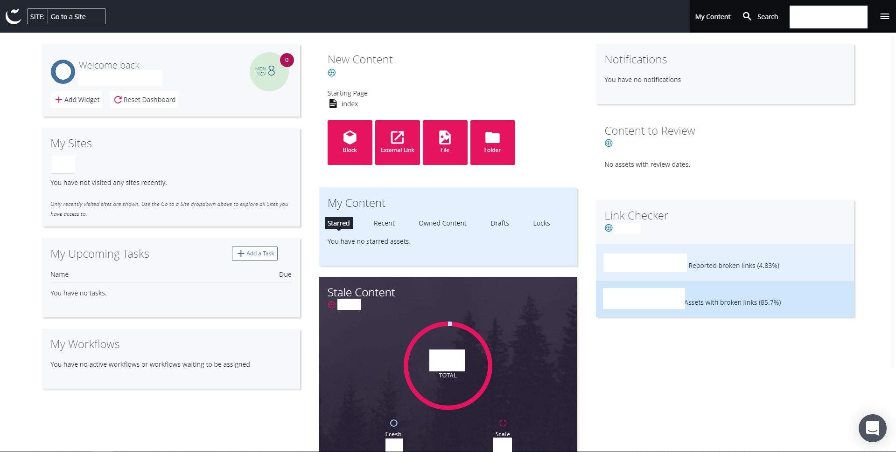
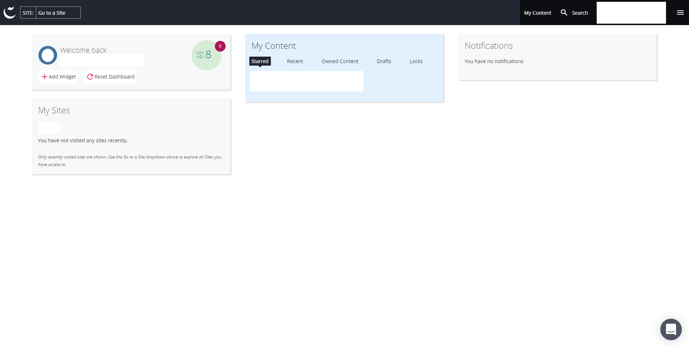
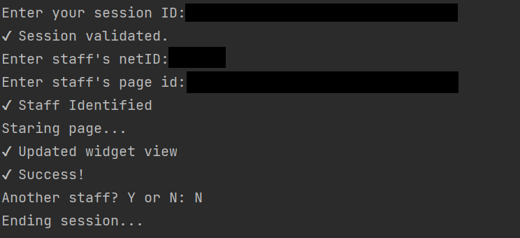

### What it does?

Mass updates Cascade user's dashboard view into 4 widgets.

_Default View_

_Updated View_

### How to run?
Grab _JSessionID_ from **Browser Dev Tools** > **Application** > **Cookies** 

Copy and Enter the value of the _JSession_ cookie.

Enter identification and page id you would like _stared_ this will show up on the dashboard for easy access.

The page id located ``campusName.cascadecms.com/assumeIdentity.act?id=PAGEID``.

### Limitations:
- Session **expires** once logged out of account
- Manually have to enter the corresponding page ID and staff ID
- User must have administer privileges

**Note:** Session ID is created when the login page is visited and validated when the user logs in successfully. If your session ID is not valid, this will not work.